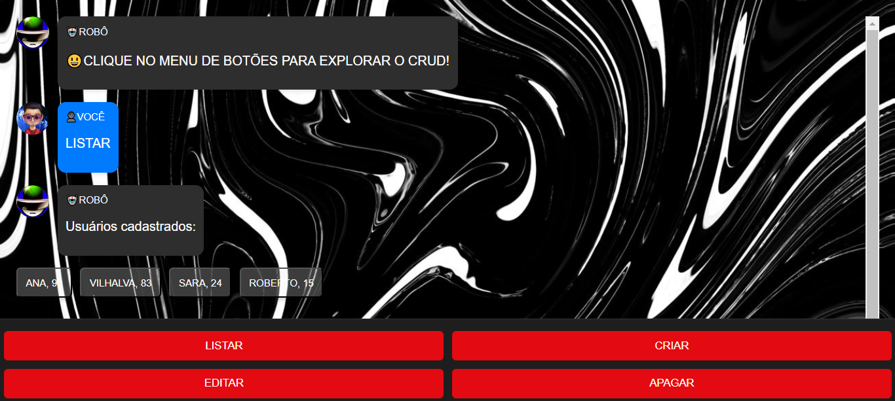
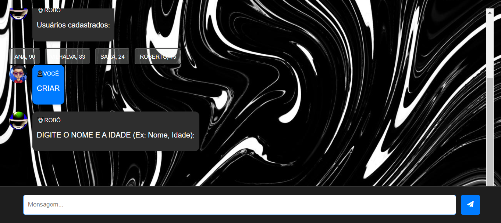
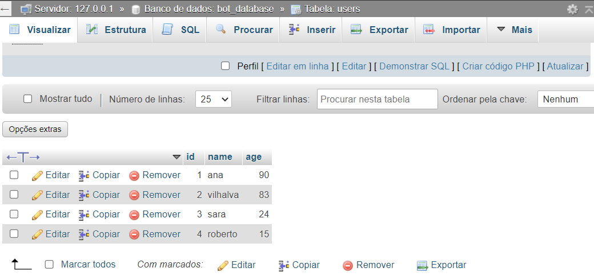

# CRUD COM WEBBOT
👨‍🏫GERENCIE O NOME E IDADE DOS USUÁRIOS NO BANCO DE DADOS MYSQL.

 <br> 
 <br>
 <br>

## DESCRIÇÃO:
Este bot é um sistema de **CRUD (Create, Read, Update, Delete)** interativo, que permite gerenciar uma lista de usuários de forma simples através de um chat com interface gráfica. Ele utiliza o banco de dados MySQL para armazenar os dados dos usuários e oferece uma série de comandos que você pode utilizar para cadastrar, listar, editar ou apagar registros de usuários.

## O QUE ELE FAZ?
- **Cadastrar Usuários:** O bot permite que você crie novos usuários com informações como nome e idade.
- **Listar Usuários:** Mostra uma lista dos usuários cadastrados no banco de dados.
- **Editar Usuários:** Permite selecionar um usuário para alterar as informações dele.
- **Apagar Usuários:** Facilita a exclusão de um usuário existente.
- **Interação por Chat:** A interface simula uma conversa em um chat, onde você digita os comandos ou clica em botões para realizar as operações.

## COMO USAR?
1. **Importar o Banco de Dados:**
   - Importe o arquivo `./DATABASE/DATABASE.sql` para o seu banco de dados MySQL.

2. **Editar o `.env`:**
   - Edite o arquivo `./CODIGO/.env` com as seguintes configurações:

     ```plaintext
     DB_HOST=localhost
     DB_USER=seu_usuario
     DB_PASSWORD=sua_senha
     DB_NAME=bot_database
     DB_PORT=3306
     ```

    - Substitua `seu_usuario` e `sua_senha` pelas suas credenciais do MySQL.

3. **Instale as Dependências:**
   - Execute `npm install` no diretório `./CODIGO` para instalar as dependências do projeto:

     ```bash
     npm install
     ```
    
    - Este comando instala todas as dependências listadas no arquivo `package.json` do projeto.

4. **Inicie o Servidor:**
   - Ainda no diretório `./CODIGO`, execute o servidor Node.js com o comando:

     ```bash
     npm start
     ```

   - O servidor estará disponível em [http://localhost:5000](http://localhost:5000).

5. **Iniciando o Bot:**
   - Ao iniciar o bot e abrir a interface (o arquivo `index.html`), uma mensagem de boas-vindas será exibida pelo robô, e você verá um menu com opções: **LISTAR**, **CRIAR**, **EDITAR**, **APAGAR**.
   - Para interagir com o bot, você pode clicar nos botões ou digitar diretamente no campo de texto.

6. **Comandos Disponíveis:**
   - **LISTAR:** Ao clicar no botão ou digitar "LISTAR", o bot irá exibir todos os usuários cadastrados no banco de dados.
   - **CRIAR:** Para criar um novo usuário, clique no botão "CRIAR" ou digite "CRIAR". O bot solicitará que você insira o nome e a idade no formato: `Nome, Idade`.
   - **EDITAR:** Clique em "EDITAR" para modificar um usuário existente. O bot exibirá os nomes dos usuários cadastrados. Após selecionar um usuário, insira o novo nome e idade.
   - **APAGAR:** Se você deseja apagar um usuário, clique em "APAGAR". O bot mostrará a lista de usuários e você poderá selecionar quem deseja remover.
   
7. **Formatos de Entrada:**
   - Ao criar ou editar um usuário, insira os dados no formato: `Nome, Idade` (por exemplo: **João, 30**).
   - Certifique-se de não deixar espaços extras ou caracteres especiais no nome para evitar erros.

8. **Mensagens do Bot:**
   - O bot sempre responde com feedback visual sobre as operações. Por exemplo, se um usuário for criado com sucesso, ele exibirá: **"Usuário João, 30 anos foi cadastrado com sucesso!"**.
   - Se não houver usuários cadastrados ou ocorrer um erro, ele também indicará isso com mensagens apropriadas.

9. **Interface de Chat:**
   - A interface é dividida em mensagens do bot e do usuário, com avatares correspondentes, e facilita a navegação através de botões que aparecem ao longo da interação.
   

## NÃO SABE?
- Entendemos que para manipular arquivos em `HTML`, `CSS` e outras linguagens relacionadas, é necessário possuir conhecimento nessas áreas. Para auxiliar nesse aprendizado, oferecemos cursos gratuitos disponíveis:
* [CURSO DE HTML E CSS](https://github.com/VILHALVA/CURSO-DE-HTML-E-CSS)
* [CURSO DE JAVASCRIPT](https://github.com/VILHALVA/CURSO-DE-JAVASCRIPT)
* [CURSO DE NODEJS](https://github.com/VILHALVA/CURSO-DE-NODEJS)
* [CURSO DE EXPRESSJS](https://github.com/VILHALVA/CURSO-DE-EXPRESSJS)
* [CURSO DE MYSQL](https://github.com/VILHALVA/CURSO-DE-MYSQL)
* [CURSO DE NODEJS COM MYSQL](https://github.com/VILHALVA/CURSO-DE-NODEJS-COM-MYSQL)
* [CURSO DE JQUERY](https://github.com/VILHALVA/CURSO-DE-JQUERY)
* [CONFIRA MAIS CURSOS](https://github.com/VILHALVA?tab=repositories&q=+topic:CURSO)

## CREDITOS:
- [PROJETO BASEADO NO "PSEUDOCRUD COM WEBBOT"](https://github.com/VILHALVA/PSEUDOCRUD-COM-WEBBOT)
- [PROJETO FEITO PELO VILHALVA](https://github.com/VILHALVA)